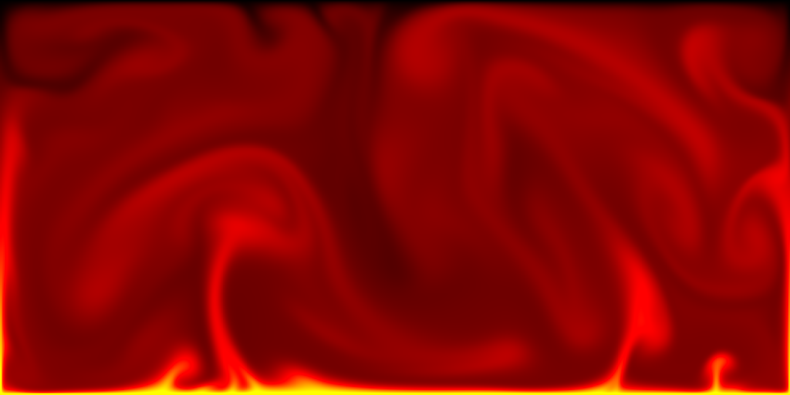

# RAVE - A solver for 2D Rayleigh Benard Convection on the GPU

This is a simple implementation of a solver for the incompressible navier-stokes equation on the GPU. The implemenation uses the CUDA OpenGL interoperability for visualization.
Currently some optimizations are missing, e.g. the use of shared memory to avoid 
expensive reloading from global GPU memory.

# Installation

Dependencies are managed with conan, which can be installed by the python package manager.
For building this project it is necessary to define the proper CUDA paths and architecture in the `CMakeLists.txt` and build from within an `build` folderwith:

    conan install .. 
    cmake .. 
    cmake --build . --config Release

Execution currently still has to be done from within the created `bin` folder 
in order to link the GLSL shaders properly.

